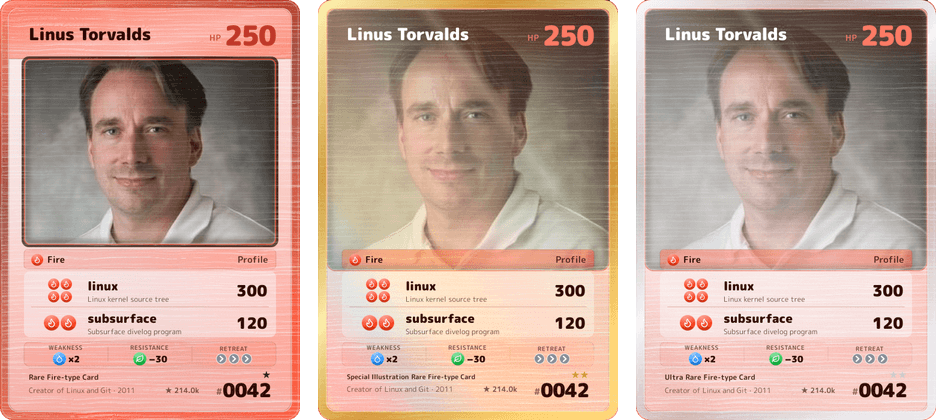

<div align="center">


# Gitmon Cards

**Trading card game cards generated from real GitHub data.**
A static image URL, no login, embeddable in any README, that keeps itself up to date.

[](https://github.com/mcsscalabrin/gitmon-cards/actions/workflows/production.yml)
[](LICENSE)
[](https://nextjs.org)


<sub>Eighteen types, one per dominant language. The discs are original art; the glyphs are <a href="https://lucide.dev">Lucide</a> (ISC) — see <a href="docs/assets-brief.md">the brief</a>.</sub>

<br>



<sub>One profile, three rarity tiers. Rarity does not just change a symbol — it changes the art treatment.</sub>

</div>

```
<host>/<username>.png            → profile card
<host>/<owner>/<repo>.png        → repository card
<host>/battle/<battle-id>.png    → static result of a battle
```

```markdown
[](https://github.com/torvalds)
```

> **Status:** v1 working locally. Profile and repository cards, battle with a shareable result,
> bilingual site. Not published yet — see `docs/decisions.md` (Q12). The full specification is in
> [`docs/rfc-001-gitmon-cards.md`](docs/rfc-001-gitmon-cards.md).

## What the card shows

Every number on the card is derived from API data by a fixed, documented formula. No text is
invented: attack names are repository names or contributor logins, and the footer is templated from
the numbers (RFC 9.2). There is no flavour text.

| Element | Where it comes from |
|---|---|
| **Type** (18) | Dominant language, weighted by stars. Map in `lib/cards/elements.ts` |
| **HP** | Profile: linear over stars, followers and repos. Repo: **logarithmic** over stars and forks |
| **Attacks** (0–2) | Profile: most-starred repositories. Repo: largest human contributors |
| **Weakness** | Profile: the developer's second language. Repo: the type chain |
| **Resistance** | Type effectiveness chain |
| **Retreat** | Profile: account age. Repo: open issue queue |
| **Rarity** (8 tiers) | Composite score, on the Pokémon TCG ladder |
| **Serial number** | Sequential by generation order, immutable once assigned |

From `rare` upwards the card gains foil, and the illustration tiers change the **art treatment** —
full-art bleed, silver or gold plating. See [`docs/design-system.md`](docs/design-system.md).

The site adds what the exported image deliberately does not carry (RFC 9.6): pack opening, specular
foil that follows the pointer, a signature radar for the profile, and a derivations panel showing
where each number came from. The PNG that travels into someone else's README stays clean.

It also speaks the card's language instead of being a wrapper around it: display and headings use
the **same typeface** Satori draws on the card (M PLUS Rounded 1c, 28 KB in two WOFF2 weights), and
the card's type tints the whole page — 7% on box backgrounds, 22% on borders. A Fire page and a
Water page are no longer the same grey page with two words swapped.

## Taking the card with you

| Output | Where it goes |
|---|---|
| **Download PNG** | Social feeds, where the file is the whole product and there is no site around it |
| **Share** | The phone's native sheet, with the file when the browser accepts it and the link when it doesn't; on desktop, copies the link |
| **Markdown snippet** | Someone else's README |

Pasting the page URL anywhere that reads Open Graph produces a **landscape** preview
(`/api/card-og/<id>`), with the whole card next to the numbers. The card is 5:7 and link previews
are 1.91:1 — pointing `og:image` straight at `/<id>.png` made the crop eat the header and the
footer. The preview embeds the real PNG rendered by `renderCard`, not a second composition: this
project has one card, and that is how it stays.

## Running locally

```bash
npm install
cp .env.example .env.local   # fill in GITHUB_TOKEN
npm run dev
```

`GITHUB_TOKEN` is any public-read token (5,000 req/h). Without it the image routes return an error
card that says so.

Full command table, environment notes and the e2e modes are in
[CONTRIBUTING.md](CONTRIBUTING.md#getting-set-up).

## Architecture

| Layer | Choice |
|---|---|
| Framework | Next.js 16 (App Router) + React 19 |
| Image generation | `next/og` (`ImageResponse` / Satori) + `sharp` for composition |
| Data cache | Redis via `ioredis` |
| Image cache | HTTP `Cache-Control` on the CDN — **no** Blob/object storage |
| GitHub auth | Server-side app token (5,000 req/h), no visitor login |
| Hosting | Vercel |

**Core principle (RFC 4.3):** visual complexity is resolved *ahead of time*, as pre-rendered static
art, not at runtime. The server only composes — it positions text and pastes a cropped image over a
PNG frame. No headless browser.

**Satori's corollary:** it implements neither `min-width: auto`, `text-overflow: ellipsis` nor
`mask-image`. Widths are explicit in `layout.json`, text is truncated at the source, and any soft
clipping is baked in `sharp` before it enters the composition.

<details>
<summary><b>Folder structure</b></summary>

```
app/
  [owner]/                     dynamic root route — serves profile and repository
    page.tsx                   profile card (web, interactive)
    [repo]/                    repository card (web, interactive)
    vs/[...opponent]/          1v1 battle (RFC 7)
  battle/[battleId]/           immutable, shareable result of a battle
  api/
    card-image/[owner]/        profile image route     → rewritten from /<user>.png
    card-image/[owner]/[repo]/ repo image route        → rewritten from /<owner>/<repo>.png
    card-og/[owner]/           landscape link preview  → only og:image points here
    card-og/[owner]/[repo]/
    battle/[battleId]/image/   result poster           → rewritten from /battle/<id>.png

components/
  card/                        interactive card: 3D tilt, live foil, pack opening,
                               signature radar, derivations panel, type icon
  battle/                      turn animation and scoreboard
  ui/                          shared primitives, PT/EN toggle, support band

lib/
  github/                      GitHub API client + typed errors
  cards/                       scoring: HP, type, attacks, weakness, retreat, rarity
    profile.ts / repo.ts       the two card formulas (RFC 6.1 and 6.2)
    rarity.ts                  8 tiers, symbol, foil and art treatment
    serial.ts                  serial number — the only durable data, assigned by a Lua script
    ratings.ts                 the 5 radar axes (signature, not measurement)
    layout.json                card geometry in pixels — single source
    palette.json               colour of the 18 types — single source, extracted from the icons
  battle/                      turn-by-turn simulation engine (RFC 7.3)
  og/                          renderCard, renderCardOg, renderBattle, renderError
  metadata.ts                  link preview tags, shared by profile and repo
  cache/                       Redis, with an in-memory fallback for dev
  i18n/                        PT/EN dictionaries (required since v1, RFC 9.1)
  config.ts                    URLs and cache policies — no hardcoded domain

scripts/
  build-assets.mjs             generates frame, full-art, foil, metal and energy (SVG → PNG)
  build-fonts.mjs              downloads and subsets the card font (TTF + WOFF2)
  assets/types/                the 18 type icons, build input — not generated by code
  lib/art.mjs                  the drawing primitives the build uses

public/assets/
  frames/                      18 type frames + 18 full-art + 6 foil + 2 metals — ORIGINALS
  energy/                      18 energy cost icons (PNG, for Satori)
  types/                       the same 18 icons in SVG, for the web interface
  brand/                       the brand mark — favicon, header and pack, one drawing
  icons/                       retreat icon
  fonts/                       M PLUS Rounded 1c, subset (SIL OFL 1.1)

docs/                          RFC + derived specs
reference/                     reference material (not production code)
tests/                         unit + e2e (Playwright)
```

The rarity symbols (`● ◆ ★`) are not assets: they are glyphs covered by the font subset.

</details>

<details>
<summary><b>Route notes</b></summary>

- `/<user>.png`, `/<owner>/<repo>.png` and `/battle/<id>.png` are **rewrites** in `next.config.ts`
  pointing at the routes under `app/api/`. The `.png` extension in the public URL is cosmetic — it
  is what makes the link pasteable in Markdown. Order matters: `/battle/<id>.png` has to match
  before the generic `/<a>/<b>.png`.
- `app/[owner]/` is a single dynamic segment serving both a profile **and** a repository owner: the
  App Router does not allow two sibling dynamic segments at the same level, so the RFC's
  `[username]` and `[owner]` collapse into one.
- The battle route `/<a>/vs/<b>` **cannot be hard-cached** (the simulation is random). It draws and
  redirects; only `/battle/<battle-id>.png` is cacheable, because it represents an already-drawn
  result (RFC 7.3).

</details>

## Documentation

> The documents below are written in **Portuguese**, as are code comments and test names. See
> [CONTRIBUTING.md](CONTRIBUTING.md#language) for why, and for what is written in English.

| File | Contents |
|---|---|
| [`docs/rfc-001-gitmon-cards.md`](docs/rfc-001-gitmon-cards.md) | Full approved RFC — the source of truth, with supersession notes where it was revised |
| [`docs/decisions.md`](docs/decisions.md) | Decisions taken outside the RFC, and questions still open |
| [`docs/design-system.md`](docs/design-system.md) | Colours, typography, the 18 types and the art treatment ladder |
| [`docs/layout-spec.md`](docs/layout-spec.md) | Pixel positions of the card composition and the type table |
| [`docs/data-mapping.md`](docs/data-mapping.md) | GitHub → card field formulas |
| [`docs/assets-brief.md`](docs/assets-brief.md) | Brief for the original art (frames, energy, rarity) |
| [`docs/foil-especular.md`](docs/foil-especular.md) | The live foil effect, and why it is a layer over the PNG |
| [`docs/gaps-revalidacao.md`](docs/gaps-revalidacao.md) | Scoreboard of known gaps, with justification |
| [`docs/revamp-visual.md`](docs/revamp-visual.md) | Visual revamp plan — direction locked, nothing implemented |
| [`PRODUCT.md`](PRODUCT.md) | Durable product truth: users, positioning, constraints and brand commitments |
| [`docs/handoff.md`](docs/handoff.md) | State of work in progress and the context that is not in the code |

The RFC is the declared source of truth. Where a later decision replaced one, the original section
stays in place with a **supersession note** right below it — the history of a decision is worth as
much as the decision.

## Contributing

Issues and pull requests are welcome. Everything you need is in
**[CONTRIBUTING.md](CONTRIBUTING.md)**: setup, the commands CI runs, the domain rules that are
locked by the RFC, and what to expect when your PR comes from a fork.

The one rule worth repeating here: **layout only breaks when you look at it.** If your PR touches
the card, render it and say in the PR what you saw.

## Copyright

No assets from The Pokémon Company, no fan icons from the reference repositories. The frames, the
foils, the metals and the coloured discs of the type icons are original. The glyph inside each disc
comes from [Lucide](https://lucide.dev), used under the ISC licence — Copyright (c) for portions of
Lucide are held by Cole Bemis 2013-2022 as part of Feather (MIT); all other copyright (c) for Lucide
are held by Lucide Contributors 2022. See `docs/assets-brief.md`.

The tier names `Illustration Rare`, `Special Illustration Rare` and `Hyper Rare` are product
terminology from The Pokémon Company, adopted here as TCG vocabulary. This is an open question —
see `docs/gaps-revalidacao.md` (3.2).

## License

MIT © Matheus Scalabrin
